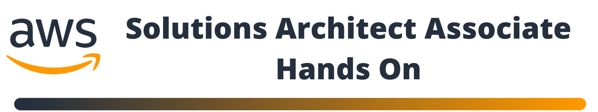

## DESCRIPCIÓN

Repositorio donde sera almacenado el código usado para resolver los hands-on propuestos en el curso oficial de AWS para la certificación de Arquitecto Asociado de Soluciones.

Estos ejercicios están resueltos usando herramientas de automatización y despliegue diferentes a las dadas en el curso de AWS. La intención es aprender a usar nuevas tecnologías que se usan dentro de la cultura DevOps ademas de habituarnos a implementar infraestructura como código. Todo esto añadirá una capa extra de complejidad a los hands-on propuestos. 

## OBJETIVOS
* Practicar los hands-on propuestos en el curso gratuito de AWS para conseguir las habilidades necesarias para presentar el examen de certificación de Arquitecto Asociado de Soluciones.
* Aprender herramientas alternas a las ofrecidas por AWS para desplegar los diferentes tipos de infraestructura y servicios asociados a este proveedor de nube.

## HERRAMIENTAS
* Terraform.
* Linux.
* GIT (Github).
* Cuenta AWS (capa gratuita).

## TRAINING OFICIAL DE AWS (gratuito)
* [AWS Training](https://www.aws.training/)

## HANDS-ON
### <b>1.   [Flujo de Trabajo Serverless](https://aws.amazon.com/es/getting-started/hands-on/create-a-serverless-workflow-step-functions-lambda/?nc1=h_ls) :</b>
* [Repositorio](https://github.com/DatamadnessDevOps/aws-solutions-architect-associate-labs-/tree/main/serveless_basic_workflow)
* [Solucion](https://www.linkedin.com/pulse/solutions-arch-associate-hands-on-john-ramirez/?trackingId=7SXuWoa0LokVUWC2Rv2yKQ%3D%3D)
### <b>2.   [Implementación Básica AWS SQS](https://aws.amazon.com/es/getting-started/hands-on/send-messages-distributed-applications/?nc1=h_ls) :</b>
* [Repositorio](https://github.com/DatamadnessDevOps/aws-solutions-architect-associate-labs-/tree/main/sqs_basic)
* [Solucion](https://www.linkedin.com/pulse/solutions-arch-associate-hands-on-john-ramirez-1c/?trackingId=XzlHeMCCQ3mo87EnItIS1w%3D%3D)

## CONTACTO
* Twitter: [@data_madness](https://twitter.com/data_madness)
* Email: datamadness81@gmail.com
* Linkedin: [https://www.linkedin.com/in/john-ramireztech/](https://www.linkedin.com/in/john-ramireztech/)