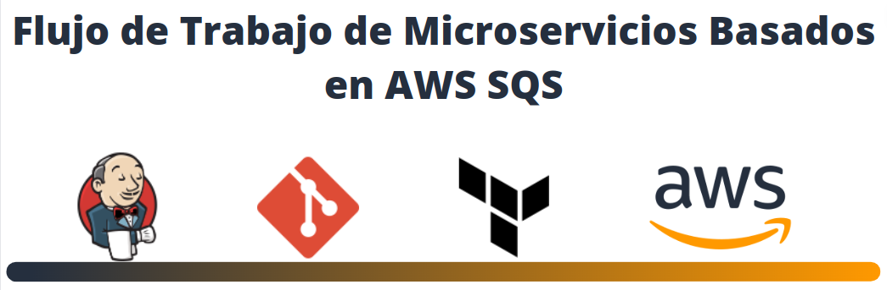

## DESCRIPCIÓN

En este hands-on utilizaremos varias herramientas que nos facilitaran orquestar de manera automática el despliegue y test. En la carpeta terraform tenemos los .tf que nos permitirán construir los recursos que requerimos. El archivo Inventario.zip contiene el código en nodejs para nuestra función lambda. Finalmente, en la carpeta scripts tendremos un script en bash por medio del cual ejecutaremos el microservicio desplegado.

## <b>[Solución](https://www.linkedin.com/pulse/solutions-arch-associate-hands-on-john-ramirez-2c/?trackingId=Vop0rrqGKlYaYOlf5Cmxow%3D%3D)</b>
## <b>[< Home](https://github.com/DatamadnessDevOps/aws-solutions-architect-associate-labs-)</b>
