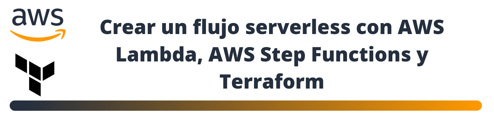

## DESCRIPCIÓN

En el repositorio se encuentran dos carpetas con el código necesario para ejecutar el hands-on. En primer lugar la carpeta functions donde están en formato .zip las funciones lambdas. En segundo lugar el directorio terraform donde están todos los archivos .tf necesarios para implementar el flujo de trabajo propuesto.

## <b>[< Solucion](https://www.linkedin.com/pulse/solutions-arch-associate-hands-on-john-ramirez/?trackingId=7SXuWoa0LokVUWC2Rv2yKQ%3D%3D)</b>
## <b>[< Volver al home](https://github.com/DatamadnessDevOps/aws-solutions-architect-associate-labs-)</b>