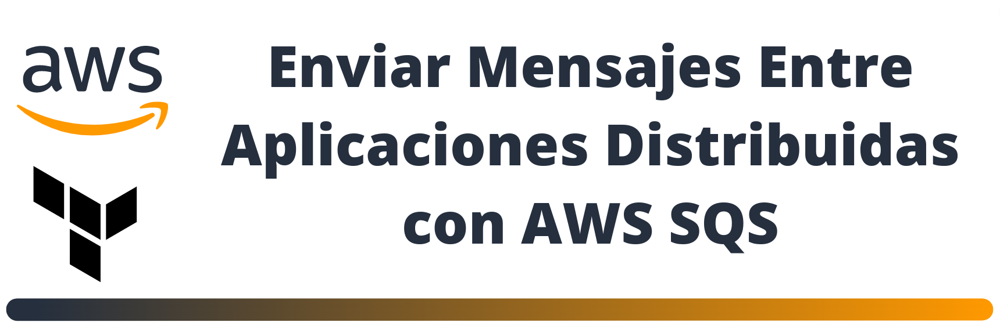

## DESCRIPCIÓN

Dentro de la carpeta terraform se encuentran los archivos .tf que nos permitiran implementar el servicio AWS SQS de manera automatica. Por favor seguir la explicación con detalle del enlace Solución.

## <b>[Solución](https://www.linkedin.com/pulse/solutions-arch-associate-hands-on-john-ramirez-1c/?trackingId=XzlHeMCCQ3mo87EnItIS1w%3D%3D)</b>
## <b>[< Home](https://github.com/DatamadnessDevOps/aws-solutions-architect-associate-labs-)</b>